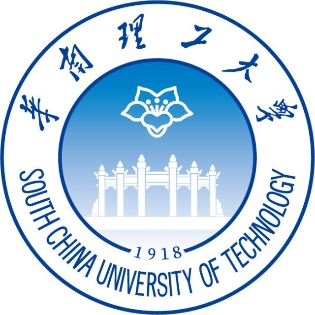

I'm a second-year Master student from <a href="https://github.com/HCIILAB" style="text-decoration:none;">SCUT-DLVCLab</a> in South China University of Technology, supervised by Prof. <a href="http://www.dlvc-lab.net/lianwen/Index.html" style="text-decoration:none;">Lianwen Jin</a>.

My research interests are

News
-----
∙ [12/2023] paper  
∙ [04/2023] project 

Education
-----

### South China University of Technology

Sep. 2022 - Present 
MS. student at SCUT-DLVCLab (Major) 

### South China University of Technology

Sep. 2018 - Jun. 2022  
B. student at SCUT-DLVCLab (Major) 

Publications
-----

Projects
-----

Award
-----
...

Blogs
-----
...

Mics
-----
...
