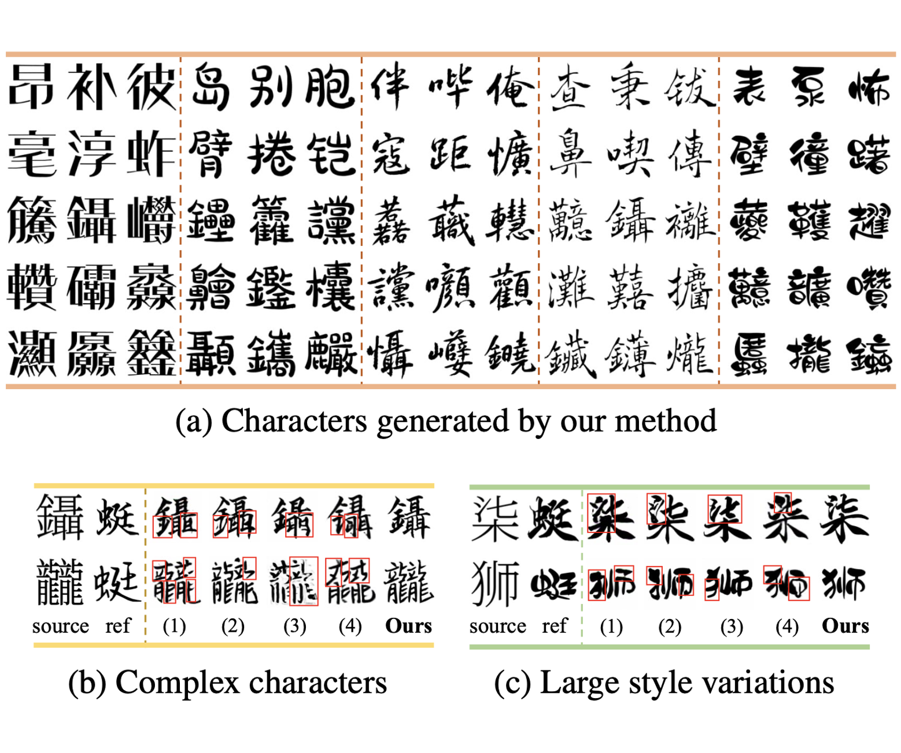
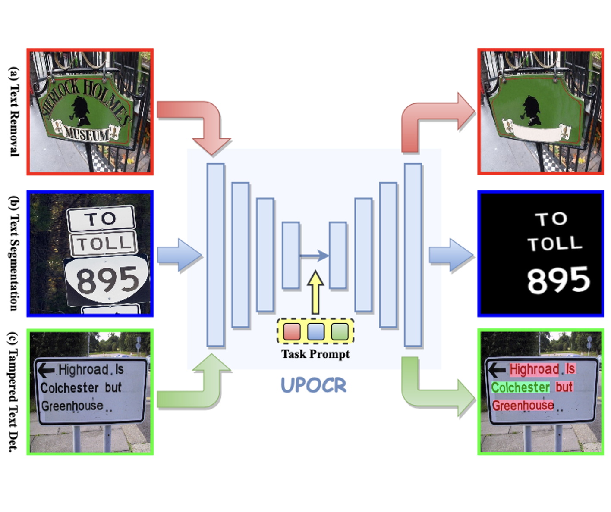
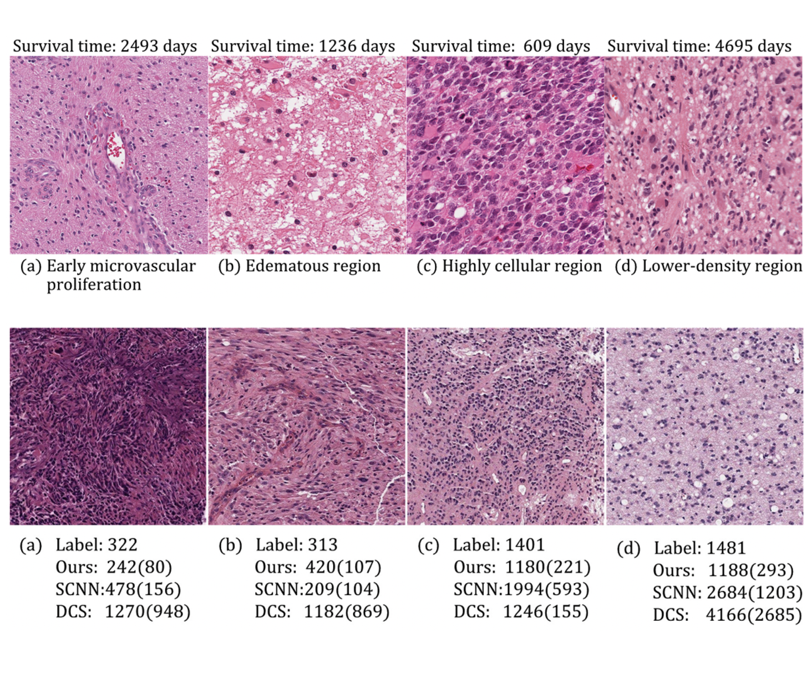
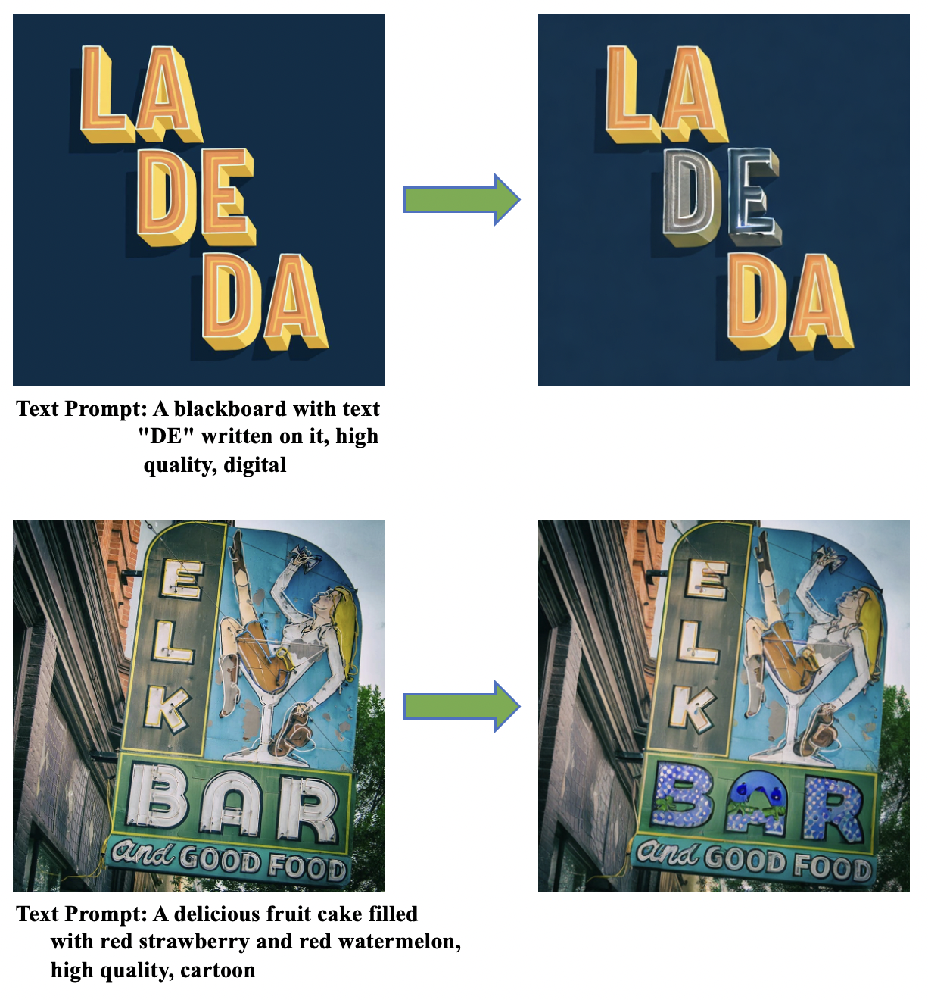
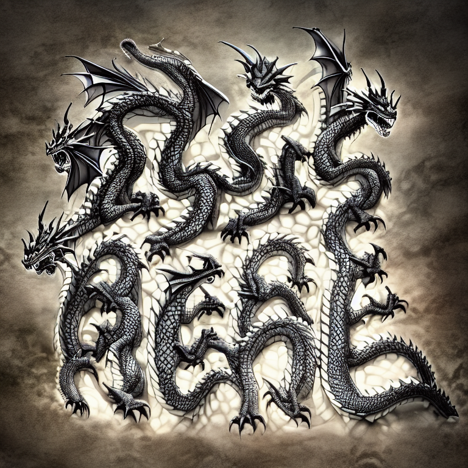
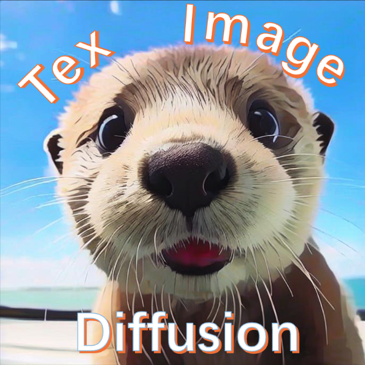

My name is Zhenhua Yang (杨振华, Yeung Chenwa), I'm a second-year Master's student from <a href="https://github.com/HCIILAB" style="text-decoration:none;">SCUT-DLVCLab</a> in <a href="https://www2.scut.edu.cn/ee/" style="text-decoration:none;">School of Electronic and Information Engineering</a>, <a href="https://www.scut.edu.cn/new/" style="text-decoration:none;">South China University of Technology</a>, supervised by <a href="http://www.dlvc-lab.net/lianwen/Index.html" style="text-decoration:none;">Prof. Lianwen Jin</a>. 
I received my Bachelor degree from <a href="https://www2.scut.edu.cn/automation/" style="text-decoration:none;">School of Automation Science and Engineering</a>, <a href="https://www.scut.edu.cn/new/" style="text-decoration:none;">South China University of Technology</a> in 2022. 
<!-- I also works closely with <a href="https://scholar.google.com/citations?user=6zNgcjAAAAAJ&hl=zh-CN&oi=ao" style="text-decoration:none;">Dezhi Peng</a> now.  -->

My research interests are focused on Diffusion Model, Image Generation, Document Restoration, and Video Generation. I am also devoted into the open source community.  

<!-- 
I'm looking for a 2025Fall PhD position!
 -->

<a href='https://github.com/yeungchenwa'>GitHub</a> / 
<a href='https://scholar.google.com/citations?hl=zh-CN&user=2ITs6lUAAAAJ'>Google Scholar</a> / 
<a href='eezhyang@gmail.com'>Email</a> / 
<a href='https://www.zhihu.com/people/young-40-31'>Zhihu</a>

News
-----
∙ **[12/2023]** 🔥🔥🔥 The 📺<a href="https://huggingface.co/spaces/yeungchenwa/FontDiffuser-Gradio" style="text-decoration:none;">Hugging Face Demo</a> and the 🧑‍💻<a href="https://github.com/yeungchenwa/FontDiffuser" style="text-decoration:none;">Github Repository</a> of <strong><a href='https://arxiv.org/abs/2312.12142'>FontDiffuser</a></strong> is released! Welcome to check it out.  
∙ **[12/2023]** 🎉 The paper <a href="https://arxiv.org/abs/2312.12142" style="text-decoration:none;">FontDiffuser</a> is accepted by <strong>AAAI2024</strong>, which excels in complex character generation and large style variation. The code and demo will be released soon. 
∙ **[12/2023]** Our paper <a href="https://arxiv.org/abs/2312.02694" style="text-decoration:none;">UPOCR</a> is released to arXiv. 

Education
-----

### South China University of Technology

Sep. 2022 - Present 
M.S student at <a href="https://github.com/HCIILAB" style="text-decoration:none;">SCUT-DLVCLab</a> in <a href="https://www2.scut.edu.cn/ee/" style="text-decoration:none;">School of Electronic and Information Engineering</a> 

-----

### South China University of Technology

Sep. 2018 - Jun. 2022  
B.E student in <a href="https://www2.scut.edu.cn/automation/" style="text-decoration:none;">School of Automation Science and Engineering</a> 

Publications
-----

### FontDiffuser: One-Shot Font Generation via Denoising Diffusion with Multi-Scale Content Aggregation and Style Contrastive Learning

<strong>Zhenhua Yang</strong>, <a href="https://scholar.google.com/citations?user=6zNgcjAAAAAJ&hl=zh-CN&oi=ao" style="text-decoration:none;">Dezhi Peng</a>, Yuxin Kong, Yuyi Zhang, <a href="https://scholar.google.com/citations?user=IpmnLFcAAAAJ&hl=zh-CN&oi=ao" style="text-decoration:none;">Cong Yao</a>, <a href="http://www.dlvc-lab.net/lianwen/Index.html" style="text-decoration:none;">Lianwen Jin</a>† 
Proceedings of the AAAI conference on artificial intelligence (<strong>AAAI</strong>), 2024 

 

### UPOCR: Towards Unified Pixel-Level OCR Interface

<a href="https://scholar.google.com/citations?user=6zNgcjAAAAAJ&hl=zh-CN&oi=ao" style="text-decoration:none;">Dezhi Peng</a>*, <strong>Zhenhua Yang*</strong>, Jiaxin Zhang, Chongyu Liu, Yongxin Shi, <a href="http://www.dlvc-lab.net/lianwen/Index.html" style="text-decoration:none;">Lianwen Jin</a>† 
arXiv Preprint, 2023 

 

<!-- -----

### Censoring-aware deep ordinal regression for survival prediction from pathological images

Lichao Xiao, Jin-Gang Yu, Zhifeng Liu, Jiarong Ou, Shule Deng, <strong>Zhenhua Yang</strong>, <a href="https://scholar.google.com/citations?hl=zh-CN&user=wN3v1coAAAAJ" style="text-decoration:none;">Yuanqing Li</a> 
Medical Image Computing and Computer Assisted Intervention, (<strong>MICCAI</strong>), 2020 

 

 -->

Open-Source Projects
-----

### Optical Character Recognition with Segment Anything (OCR-SAM)

<strong>Zhenhua Yang</strong>, Qing Jiang 
Can SAM be applied to OCR? We take a simple try to combine two off-the-shelf OCR models in MMOCR with SAM to develop some OCR-related application demos, including SAM for Text, Text Removal and Text Inpainting. And we also provide a WebUI by gradio to give a better interaction. 

 

-----

### FontDiffuser: One-Shot Font Generation via Denoising Diffusion

<strong>Zhenhua Yang</strong> 
We propose FontDiffuser, which is capable to generate unseen characters and styles, and it can be extended to the cross-lingual generation, such as Chinese to Korean. 

 

-----

### Recommendations of Diffusion for Text-Image

<strong>Zhenhua Yang</strong> 
A paper collection of recent diffusion models for text-image generation tasks, e,g., visual text generation, font generation, text removal, text image super resolution, text editing, handwritten generation, scene text recognition and scene text detection. 

 

Award
-----
- Shenzhen HighPower Technology Scholarship, 2022. (Top 2%)
- First-Class Campus Scholarship, 2021. (Top 5%)
- Second-Class Campus Scholarship, 2020. (Top 10%)
- American Mathematical Contest in Modeling, Meritorious Prize, 2020
- Alibaba Tianchi Competition of Tile Defeat Detection, Top 1.2%, 2021

Blogs
-----
[SAM(Segment-Anything)在OCR文本图像领域的可视化效果及简单分析](https://www.zhihu.com/question/593914819/answer/2976012032)  
[2020年美赛心得](https://www.zhihu.com/question/268052818/answer/1185708631)

Mics
-----
**Hobby**: Love a lot of sports, like Fishing🎣, Swimming🏊‍♂️, Riding Car🚲, Table tennis🎱🏓, Ball🏀⚽️, Badminton🏸 and Singing🎤. I am learning to play the piano🎹 currently.  
**Game Award**: Our college team won the first-place in campus basketball games🏀🏆 twice when I was an undergradauate, spending the wonderfull time in my life.  
**Languange**: Chinese, English, Cantonese, and Hakka.  
**Habit**: A heavy coffee drinker ☕️~  

<table style="width: 50%; max-width: 600px" align="center" border="0" cellpadding="20">
    
    <!--  -->
</table>
