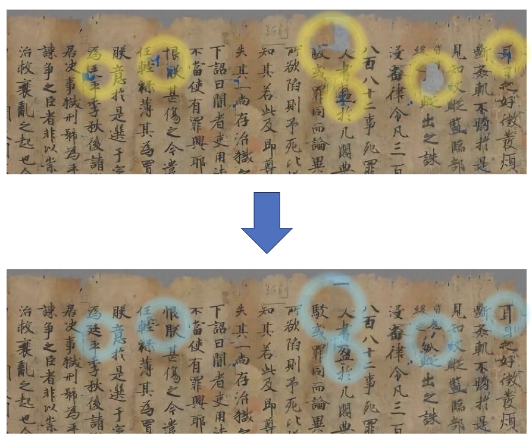
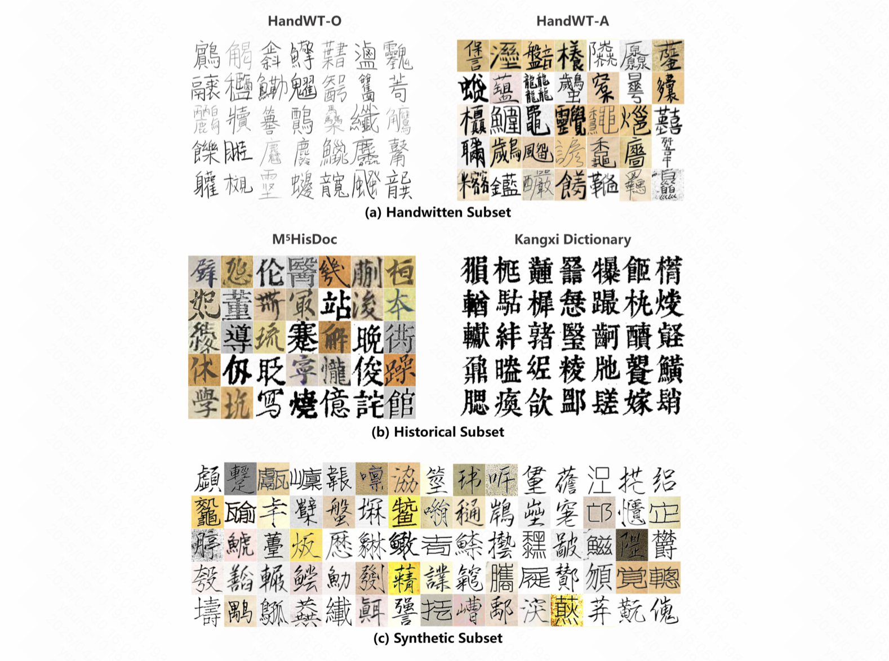
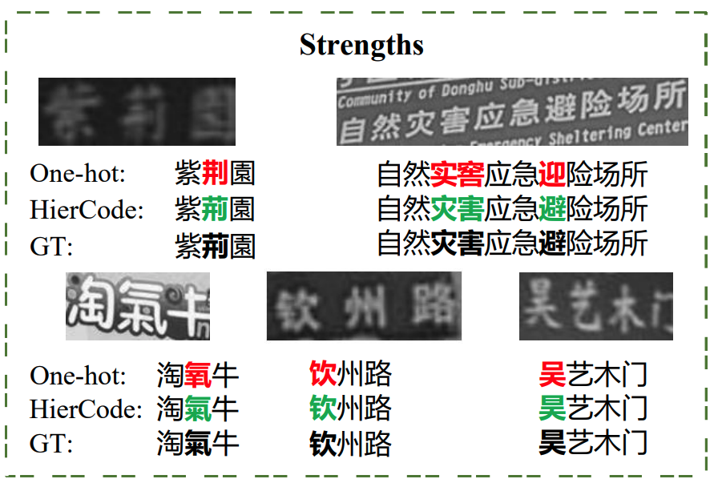
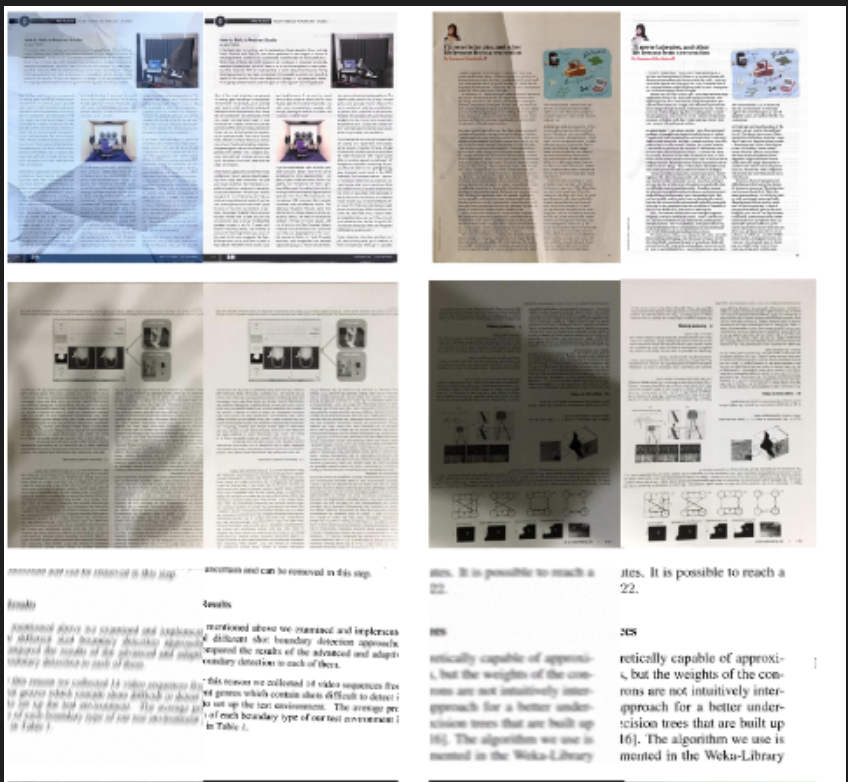

My name is Zhenhua Yang (杨振华, Yeung Chenwa).
I'm a third-year Master's student from <a href="https://github.com/HCIILAB" style="text-decoration:none;">SCUT-DLVCLab</a> in <a href="https://www2.scut.edu.cn/ee/" style="text-decoration:none;">School of Electronic and Information Engineering</a>, <a href="https://www.scut.edu.cn/new/" style="text-decoration:none;">South China University of Technology</a>, supervised by <a href="http://www.dlvc-lab.net/lianwen/Index.html" style="text-decoration:none;">Prof. Lianwen Jin</a>. 
I received my Bachelor degree from <a href="https://www2.scut.edu.cn/automation/" style="text-decoration:none;">School of Automation Science and Engineering</a>, <a href="https://www.scut.edu.cn/new/" style="text-decoration:none;">South China University of Technology</a> in 2022. 

Previously, I have interned at <a href="https://klingai.com/global/" style="text-decoration:none;">Kling Team</a> of Kuaishou (advised by <a href="https://www.xtao.website/" style="text-decoration:none;">Xin Tao</a>)
and <a href="https://www.idea.edu.cn/" style="text-decoration:none;">International Digital Economy Academy (IDEA)</a> (advised by Prof. <a href="https://www.leizhang.org/" style="text-decoration:none;">Lei Zhang</a> and Dr. <a href="https://haozhang534.github.io/" style="text-decoration:none;">Hao Zhang</a>).

My research interests are focused on AIGC, Generative Model, and Large Multi-Modal Models. I am also devoted into the open source community. 

<!-- I am enthusiastic about discussing with different people. If you are interested, please feel free to $\color{#FF00FF}{contact\ me}$! -->
<!-- 
[News] I will graduate in June 2025 and I am open to industrial research/engineering positions. If you are interested, please feel free to contact me.
 -->

<!-- 
I'm looking for a 2025Fall PhD position!
 -->

<a href='https://github.com/yeungchenwa'>GitHub</a> / 
<a href='https://scholar.google.com/citations?hl=zh-CN&user=2ITs6lUAAAAJ'>Google Scholar</a> / 
<a href='eezhyang@gmail.com'>Email</a> / 
<a href='https://www.zhihu.com/people/young-40-31'>Zhihu</a> / 
<a href='https://www.linkedin.com/in/zhenhua-yang-3911982b2'>Linkin</a>

News
-----
∙ **[02/2025]** 🎉🎉🎉 Our paper <a href="https://arxiv.org/abs/2412.11634" style="text-decoration:none;">HDR</a> is selected as the **oral** presentation  
∙ **[12/2024]** The inference code of our paper <a href="https://arxiv.org/abs/2412.11634" style="text-decoration:none;">HDR</a> is released in <a href="https://github.com/yeungchenwa/HDR" style="text-decoration:none;">link</a>. 
∙ **[12/2024]** Our paper <a href="https://arxiv.org/abs/2412.11634" style="text-decoration:none;">HDR</a> is accepted by **AAAI 2025** 🎉🎉🎉, and the dataset, code and weight will be public soon. 🌹🌹🌹 
∙ **[07/2024]** I will attend to **ICML 2024** conference in person in Vienna, Austria. Open to have a disscussion or play with you. 🌹🌹🌹 
∙ **[06/2024]** Now I am interned at <a href="https://www.idea.edu.cn/" style="text-decoration:none;">International Digital Economy Academy (IDEA)</a>, supervised by Prof. <a href="https://www.leizhang.org/" style="text-decoration:none;">Lei Zhang</a> and closely work with Dr. <a href="https://haozhang534.github.io/" style="text-decoration:none;">Hao Zhang</a>, where I am working on the topic of vision-language large model for video understanding. 
∙ **[05/2024]** Our paper <a href="https://arxiv.org/abs/2312.02694" style="text-decoration:none;">UPOCR</a> is accepted by ICML 2024 🎉🎉🎉. 
∙ **[12/2023]** 🔥🔥🔥 The 📺<a href="https://huggingface.co/spaces/yeungchenwa/FontDiffuser-Gradio" style="text-decoration:none;">Hugging Face Demo</a> and the 🧑‍💻<a href="https://github.com/yeungchenwa/FontDiffuser" style="text-decoration:none;">Github Repository</a> of <strong><a href='https://arxiv.org/abs/2312.12142'>FontDiffuser</a></strong> is released! Welcome to check it out.  
∙ **[12/2023]** 🉠The paper <a href="https://arxiv.org/abs/2312.12142" style="text-decoration:none;">FontDiffuser</a> is accepted by <strong>AAAI2024</strong>, which excels in complex character generation and large style variation. The code and demo will be released soon. 
∙ **[12/2023]** Our paper <a href="https://arxiv.org/abs/2312.02694" style="text-decoration:none;">UPOCR</a> is released to arXiv. 

Education
-----

### South China University of Technology

Sep. 2022 - Present 
M.S student at <a href="https://github.com/HCIILAB" style="text-decoration:none;">SCUT-DLVCLab</a> in <a href="https://www2.scut.edu.cn/ee/" style="text-decoration:none;">School of Electronic and Information Engineering</a> 

-----

### South China University of Technology

Sep. 2018 - Jun. 2022  
B.E student in <a href="https://www2.scut.edu.cn/automation/" style="text-decoration:none;">School of Automation Science and Engineering</a> 

Experience
-----

### <a href="https://klingai.com/global/" style="text-decoration:none;">KuaiShou - Kling Team</a>

Jan. 2025 - Apr. 2025  
Research Intern  
Unifying Model for Generation and Understanding, supervised by <a href="https://klingai.com/global/" style="text-decoration:none;">Xin Tao</a>. 

-----

### <a href="https://www.idea.edu.cn/" style="text-decoration:none;">International Digital Economy Academy (IDEA)</a> - <a href="https://github.com/IDEA-Research" style="text-decoration:none;">CVR</a>

Jun. 2024 - Sep. 2024  
Research Intern  
Streaming Video Captioning and Understanding / Region Caption, supervised by Prof. <a href="https://www.leizhang.org/" style="text-decoration:none;">Lei Zhang</a>. 

-----

### <a href="https://www.intsig.com/" style="text-decoration:none;">INTSIG</a> - <a href="https://www.intsig.com/personal-camscanner" style="text-decoration:none;">CamScanner</a>

Mar. 2024 - May 2024  
Engineering Intern  
Editing documents in real-world scenarios. 

Publications
-----

### Predicting the Original Appearance of Damaged Historical Documents

<strong>Zhenhua Yang*</strong>, <a href="https://scholar.google.com/citations?user=6zNgcjAAAAAJ&hl=zh-CN&oi=ao" style="text-decoration:none;">Dezhi Peng</a>*, Yongxin Shi, Yuyi Zhang, Chongyu Liu, <a href="http://www.dlvc-lab.net/lianwen/Index.html" style="text-decoration:none;">Lianwen Jin</a>† 
Proceedings of the AAAI conference on artificial intelligence (<strong>AAAI Oral</strong>), 2025  

 

-----

### FontDiffuser: One-Shot Font Generation via Denoising Diffusion with Multi-Scale Content Aggregation and Style Contrastive Learning

<strong>Zhenhua Yang</strong>, <a href="https://scholar.google.com/citations?user=6zNgcjAAAAAJ&hl=zh-CN&oi=ao" style="text-decoration:none;">Dezhi Peng</a>, Yuxin Kong, Yuyi Zhang, <a href="https://scholar.google.com/citations?user=IpmnLFcAAAAJ&hl=zh-CN&oi=ao" style="text-decoration:none;">Cong Yao</a>, <a href="http://www.dlvc-lab.net/lianwen/Index.html" style="text-decoration:none;">Lianwen Jin</a>† 
Proceedings of the AAAI conference on artificial intelligence (<strong>AAAI</strong>), 2024 

 

-----

### UPOCR: Towards Unified Pixel-Level OCR Interface

<a href="https://scholar.google.com/citations?user=6zNgcjAAAAAJ&hl=zh-CN&oi=ao" style="text-decoration:none;">Dezhi Peng</a>*, <strong>Zhenhua Yang*</strong>, Jiaxin Zhang, Chongyu Liu, Yongxin Shi, <a href="http://www.dlvc-lab.net/lianwen/Index.html" style="text-decoration:none;">Lianwen Jin</a>† International Conference on Machine Learning (<strong>ICML</strong>), 2024 

 

-----

### MegaHan97K: A Large-Scale Dataset for Mega-Category Chinese Character Recognition with over 97K Categories

Yuyi Zhang, Yongxin Shi, Peirong Zhang, Xinyi Zhang, <strong>Zhenhua Yang</strong>, <a href="http://www.dlvc-lab.net/lianwen/Index.html" style="text-decoration:none;">Lianwen Jin</a>† 
Pattern Recognition (<strong>PR</strong>), 2025 
<!--  -->

 

-----

### HierCode: A Lightweight Hierarchical Codebook for Zero-shot Chinese Text Recognition

Yuyi Zhang, Yuanzhi Zhu, Dezhi Peng, Peirong Zhang, <strong>Zhenhua Yang</strong>, <a href="http://www.dlvc-lab.net/lianwen/Index.html" style="text-decoration:none;">Lianwen Jin</a>† 
Pattern Recognition (<strong>PR</strong>), 2024 

 

-----

### Censoring-aware deep ordinal regression for survival prediction from pathological images

Lichao Xiao, Jin-Gang Yu, Zhifeng Liu, Jiarong Ou, Shule Deng, <strong>Zhenhua Yang</strong>, <a href="https://scholar.google.com/citations?hl=zh-CN&user=wN3v1coAAAAJ" style="text-decoration:none;">Yuanqing Li</a> 
Medical Image Computing and Computer Assisted Intervention, (<strong>MICCAI</strong>), 2020 

 

Open-Source Projects
-----

### Optical Character Recognition with Segment Anything (OCR-SAM)

<strong>Zhenhua Yang</strong>, Qing Jiang 
Can SAM be applied to OCR? We take a simple try to combine two off-the-shelf OCR models in MMOCR with SAM to develop some OCR-related application demos, including SAM for Text, Text Removal and Text Inpainting. And we also provide a WebUI by gradio to give a better interaction. 

 

-----

### FontDiffuser: One-Shot Font Generation via Denoising Diffusion

<strong>Zhenhua Yang</strong> 
We propose FontDiffuser, which is capable to generate unseen characters and styles, and it can be extended to the cross-lingual generation, such as Chinese to Korean. 

 

-----

### Recommendations of Diffusion for Text-Image

<strong>Zhenhua Yang</strong> 
A paper collection of recent diffusion models for text-image generation tasks, e,g., visual text generation, font generation, text removal, text image super resolution, text editing, handwritten generation, scene text recognition and scene text detection. 

 

-----

### Recommendations of Document Image Processing

Jiaxin Zhang, <strong>Zhenhua Yang</strong> 
A paper collection of the methods for document image processing, including appearance enhancement, deshadow, dewarping, deblur, and binarization. 

 

-----

Award
-----
- Shenzhen HighPower Technology Scholarship, 2022. (Top 2%)
- First-Class Campus Scholarship, 2021. (Top 5%)
- Second-Class Campus Scholarship, 2020. (Top 10%)
- American Mathematical Contest in Modeling, Meritorious Prize, 2020
- Alibaba Tianchi Competition of Tile Defeat Detection, Top 1.2%, 2021

Blogs
-----
[SAM(Segment-Anything)在OCR文本图像领域的可视化效果及简单分析](https://www.zhihu.com/question/593914819/answer/2976012032)  
[2020年美赛心得](https://www.zhihu.com/question/268052818/answer/1185708631)

Mics
-----
**Hobby**: Love a lot of sports, like Fishing🎣, Swimming🏊‍♂️, Riding Car🚲, Table tennis🎱🏓, Ball🏀⚽️, Badminton🏸 and Singing🎤. I am learning to play the piano🎹 currently.  
**Game Award**: Our college team won the first-place in campus basketball games🏀🏆 twice when I was an undergradauate, spending the wonderfull time in my life.  
**Languange**: Chinese, English, Cantonese, and Hakka.  
**Habit**: A heavy coffee drinker ☕️~  

<table style="width: 50%; max-width: 600px" align="center" border="0" cellpadding="20">
    <!--  -->
    <!--  -->
    
</table>
